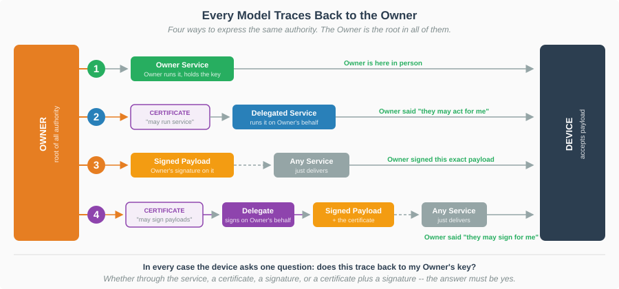
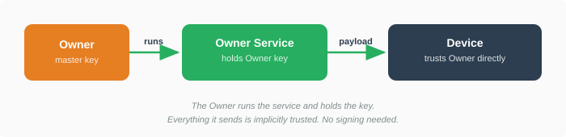
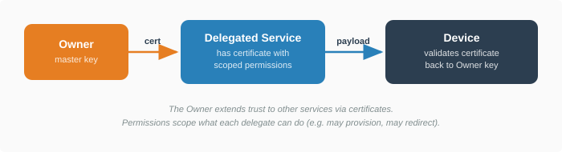
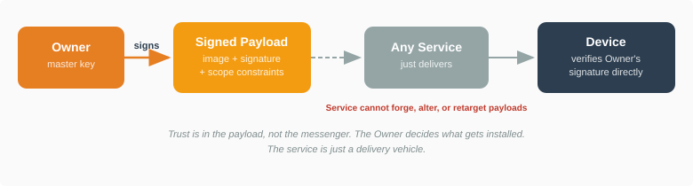
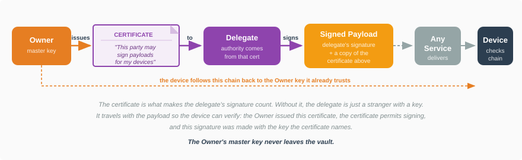
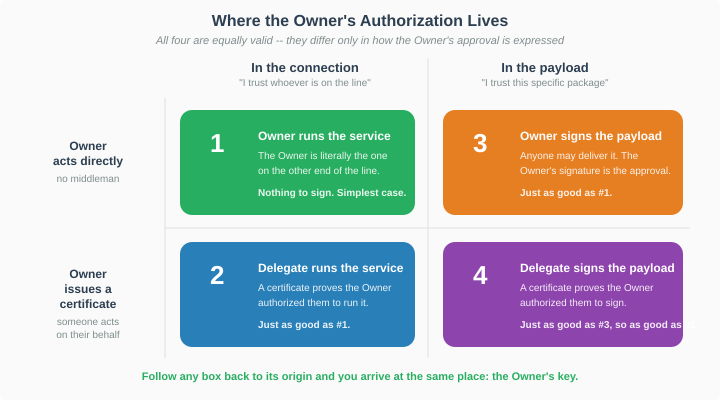

# Securing BMO Images and Onboarding Payloads

**Version:** 1.0 (Draft)
**Status:** Working Document

Copyright &copy; 2026 Dell Technologies and FIDO Alliance
Author: Brad Goodman, Dell Technologies

---

## What This Document Is About

When a device is onboarded with FDO, it receives things: a boot image, an OS installer, a disk image, a configuration bundle, firmware settings. These are collectively *provisioning payloads* -- the content that turns bare metal into a working system.

**The question is: how does a device know that what it received is something its Owner actually wanted it to have?**

This isn't about whether the connection is secure -- FDO already encrypts and authenticates the session. It's about whether the *content* was approved by someone who had the right to approve it.

### The one idea behind everything in this document

There is exactly one rule, and every mechanism described here is an application of it:

> **The Owner is the root of all authority. A device accepts a payload only if it can trace the approval back to its Owner's key.**

The Owner's approval can be expressed in four different ways, depending on how you've organized your infrastructure. Every one of them is equally valid, because every one of them ends up at the same place:

| | If... | Then the device reasons... |
|---|---|---|
| **1** | The Owner is running the service | "The Owner is here in person. Approved." |
| **2** | The Owner issued a certificate saying someone else may run the service | "The Owner said this party may act for them. **Just as good as #1.**" |
| **3** | The Owner signed the payload itself | "The Owner approved this exact package, whoever handed it to me. **Just as good as #1.**" |
| **4** | The Owner issued a certificate saying someone else may sign payloads | "The Owner said this party may sign for them. **Just as good as #3 -- which is just as good as #1.**" |



These are not four competing security architectures. They are four routes to the same destination. The device doesn't care which route was taken -- it only cares that the route terminates at the Owner's key.

The rest of this document walks through each one, why you'd choose it, and what it costs you. No protocol knowledge is assumed; protocol-level details are collected in an [appendix](#appendix-protocol-details).

### Terms used in this document

| Term | Meaning |
|---|---|
| **Owner** | The organization that owns and controls the devices. |
| **Owner key** | The master cryptographic key that represents the Owner's authority. The root of all trust decisions below. |
| **Owner service** | An onboarding service operated by the Owner, holding the Owner key. |
| **Delegate** | Any party the Owner has authorized, via certificate, to do something on its behalf. |
| **Certificate** | A signed statement from the Owner: "this party may do X." Verifiable by anyone who knows the Owner key. |
| **Payload** | The content being delivered: boot image, installer, config bundle, firmware settings. |
| **Signed payload** | A payload with an attached signature, so its approval travels with it instead of being inferred from who delivered it. |

**How the device knows the Owner key in the first place:** during manufacturing, each device is associated with an *Ownership Voucher* -- a signed record establishing who owns it. When the device onboards, it verifies this record and extracts the Owner's public key. From that moment the device has a trustworthy copy of the Owner key, and every decision in this document is made against it. This is why "trace it back to the Owner key" is a meaningful test rather than circular reasoning.

---

## 1. The Owner Runs the Service

The simplest deployment: you own your devices, you run your own onboarding service, and that service holds your Owner key.



When a device connects, the two sides authenticate each other. The service proves it holds the Owner key. The device proves it is the device named in its Ownership Voucher. After that exchange there is an encrypted session between them, and the device knows with certainty that the party on the other end is its Owner.

So anything that arrives over that session is approved by definition. The Owner is *right there*, saying "install this." There is nothing further to verify.

**This is the baseline.** No payload signing. No special tooling. No per-device preparation. You give your service the images, your devices receive them.

### When this is the right choice

- You operate your own onboarding service
- That service can access the Owner key
- You trust your own infrastructure to send the right payloads

Most single-organization deployments look like this. If you're an enterprise running onboarding for your own fleet out of your own datacenter, you need nothing more.

---

## 2. A Delegate Runs the Service

One central service doesn't scale forever. You open offices on other continents. Separate teams run separate sites. You contract a managed service provider for a remote facility. You want someone else to run onboarding **without handing them your Owner key**.

The Owner issues a **certificate** -- a signed statement saying "this party may run onboarding services for my devices." The certificate also lists *which* operations are permitted, so you can grant narrowly.



When a device connects to that service, the service presents the certificate. The device checks two things: that the certificate was issued by its Owner, and that it grants the operation being attempted. If both hold, the service is authorized.

**Why this is just as good as #1:** the device isn't taking the delegate's word for anything. It is reading a statement *signed by the Owner*, verified against the Owner key it already holds. The Owner said, in advance and in writing, "this party may act for me." Accepting the delegate's payloads is accepting the Owner's instruction, one step removed.

Permissions let you be precise. You can authorize a delegate to onboard devices and exchange configuration while *denying* it permission to install boot images or change firmware settings. The device enforces exactly what the certificate says.

### When this is the right choice

- You run services at several sites, possibly operated by different teams
- You trust each delegate to choose the right payloads within its scope
- You're comfortable granting a capability like "may install images" wholesale

What this *doesn't* give you is control over *which* image a delegate installs. A delegate permitted to provision can provision anything it likes. To control that, keep reading.

---

## 3. The Owner Signs the Payload

Now the harder problem. You're provisioning thousands of devices across hundreds of sites. You don't run those services -- regional operators, integrators, or CDN providers do. You're willing to let them *deliver* payloads. You are not willing to let them *choose* payloads.

So instead of the approval being implied by who's on the connection, **the Owner signs the payload itself**. The approval is attached to the package and travels with it.



The delivery service hands the signed payload to the device. The device verifies the signature against the Owner key it already holds. Valid signature, install. Invalid or missing, reject -- regardless of who delivered it.

**Why this is just as good as #1:** in model 1 the Owner tells the device "install this" over a live connection. Here the Owner says exactly the same thing, in a signed document, ahead of time. The instruction is identical and the authority behind it is identical -- the Owner's key. The only change is *when* it was issued and *who carried it*. Neither of those weakens it, because a signature is checkable by itself.

The delivery service cannot forge a signature (no Owner key), cannot alter the payload (the signature would break), and cannot retarget it (see scoping below). A compromised delivery service can refuse to deliver, but it cannot install something the Owner didn't approve.

### Scoping: narrowing what a signed payload authorizes

A signed payload is a standalone permission slip: whoever holds a copy can present it. Often that's fine -- one golden image approved for the whole fleet. When it isn't, the Owner can write limits into the signature itself:

| Limit | Meaning | Why |
|---|---|---|
| **Device binding** | "Only for device *X*" | Stops a payload meant for one machine from being applied to another. The device compares its own identifier and refuses on mismatch. |
| **Expiration** | "Valid until *date*" | Stops an old payload from being replayed forever. Especially matters once an image is found to be vulnerable. |
| **Supersession** | "This replaces everything earlier" | A counter that only moves forward. Once a device accepts number 5 it will never accept number 4 again, even if someone replays it. Works without a trustworthy clock. |

These limits are covered by the signature, so the delivery service cannot alter or remove them.

**Devices fail closed.** If a payload carries a limit the device cannot evaluate -- an expiration date on a device with no reliable clock, for instance -- the device **rejects the payload** rather than ignoring the limit. You get a clear error and can re-issue without it. The worst case is a visible failure, never a silent bypass. That means you can add limits freely without auditing every device first.

### When this is the right choice

- A third party operates the service and you don't fully trust it
- You want to decide in advance exactly which payload each device gets
- Payloads must survive caching, CDN distribution, or offline handoff
- You need to expire or supersede payloads you've already issued

---

## 4. A Delegate Signs the Payload

One thing remains. In a large organization the Owner key is a crown jewel -- it controls every device you own. You cannot hand it to every engineer who builds a provisioning image. But those engineers need to approve images.

Same answer as model 2, applied to signing instead of serving: **the Owner issues a certificate that says "this party may sign payloads."** The delegate gets their own key and signs with it. A copy of the certificate rides along with each signed payload.



The certificate is the whole point. Without it, the delegate is a stranger holding a key, and their signature means nothing. With it, the device can walk the chain:

1. Here is a payload signed by some key.
2. Attached is a certificate naming that key.
3. That certificate was signed by my Owner. *(verified against the Owner key)*
4. That certificate says this party may sign payloads. *(permission check)*
5. Therefore the Owner approved this payload, indirectly. Accept.

**Why this is just as good as #3:** the device ends up at the Owner's key either way. In model 3 the Owner's signature is one hop from the Owner. Here it's two hops -- signature, then certificate, then Owner -- but every hop is cryptographically verified and the chain terminates in the same place. The Owner's master key never leaves the vault.

This is ordinary PKI practice. The Owner can issue short-lived certificates, revoke them, scope them narrowly, and audit who signed what.

---

## Putting It All Together



Two things vary across the four models:

- **Where the approval lives** (columns): in the *connection*, meaning the device trusts whoever authenticated; or in the *payload*, meaning the device trusts a specific signed package no matter who delivered it.
- **Whether the Owner acted directly or issued a certificate** (rows): the Owner does it itself, or the Owner signs a statement letting someone else do it.

Combine those and you get the four models. **Every cell is a valid way to express the Owner's approval**, which is why none of them is "more secure" in the abstract -- they encode the same authority through different plumbing.

What they *do* differ in is practical consequence:

| | Approval in the connection (1, 2) | Approval in the payload (3, 4) |
|---|---|---|
| Preparation per payload | None | Sign each one |
| Who picks the content | Whoever runs the service | The Owner (or an authorized signer), in advance |
| Delivery service must be trusted | Yes | **No** |
| Survives caching, CDN, offline handoff | No -- needs a live session | **Yes** |
| Can be bound to one device, expired, superseded | No | **Yes** |

Going right buys you control over content at the cost of having to sign. Going down buys you organizational reach at the cost of managing certificates.

**You can mix these in one fleet.** Some devices provisioned from your own service (1). Others through a partner's infrastructure with payloads you signed (3). Others by regional teams signing with delegated keys (4). The device doesn't need to know or care which -- it runs the same check every time: *does this trace back to my Owner's key?*

---

## What This Means in Practice

### Every payload is approved separately

A device may receive several payloads during onboarding -- a boot image, firmware settings, a configuration bundle. **Each carries its own approval.** They can be signed by different people, under different certificates, with different limits.

That isn't redundancy. Different payloads legitimately differ:

- Prepared by different teams (platform team builds the OS image; security team sets the firmware policy)
- Valid for different periods (the image for a quarter; the firmware setting permanently)
- Scoped differently (the image fleet-wide; a device password to exactly one machine)

### Building and delivering signed payloads

Two tools work together: **`fdo-meta-tool`** signs payloads offline, and the **FDO server** delivers them. Which tool does the signing -- and whether signing happens at all -- depends on which model you're using and why. Here are the concrete scenarios:

#### Model 1: No signing needed

You run the Owner service with the Owner key. Payloads go directly to the device unsigned.

```bash
# Just serve the image -- the service IS the Owner
server -bmo "application/x-uefi-image:image.efi"
```

#### Model 2: No signing needed (delegate service)

The delegate service holds a certificate with provisioning permission. Same as model 1, but the server was issued a delegate certificate and presents it during onboarding.

```bash
# Delegate service -- no signing, the certificate covers it
server -delegate delegate-chain.pem:delegate-key.pem \
    -bmo "application/x-uefi-image:image.efi"
```

#### Model 3: Owner signs, someone else delivers

This is the scenario where `-bmo-sign` makes sense. You have the Owner key and you *could* just serve unsigned payloads (model 1), but you want to hand the signed payload off to a partner who runs the onboarding service. The partner's service doesn't have provisioning permission -- it only has onboard permission -- so the payload itself must carry the Owner's approval.

**Step 1: Sign the payload** (on the Owner's machine, offline or in a build pipeline):

```bash
# Owner signs the payload with optional scope constraints
fdo-meta-tool provision sign \
    -key owner-private.pem \
    -in my-image-payload.cbor \
    -guid "a603fddbc3ff231b116b7611a9b4c03b" \
    -not-after 1735689600 \
    -out my-image-payload-signed.cbor
```

**Step 2: Give the signed payload to the partner's service.** The partner's service delivers it without needing the Owner key:

```bash
# Partner's delegate service: onboard permission only, no provision permission
# Delivers the pre-signed payload as-is via meta-URL
server -delegate partner-chain.pem:partner-key.pem \
    -bmo-meta-url "https://artifacts.example.com/my-image-payload-signed.cbor"
```

The partner cannot forge a new payload (no Owner key), cannot alter the scope constraints (they're covered by the signature), and cannot substitute a different image. They can only deliver what the Owner gave them.

**Alternatively, if you run both the signing and the service yourself** (perhaps for air-gapped or HSM-based signing where the Owner key isn't on the server), the server can sign on the fly at delivery time:

```bash
# Owner service signs each payload at delivery time
server -bmo "application/x-uefi-image:image.efi" -bmo-sign
```

This is convenient for testing and for deployments where the Owner key is accessible to the server process, but it's not the primary use case for model 3 -- if you already run the service and have the key, model 1 is simpler.

#### Model 4: A delegate signs, someone else delivers

Your IT team member (or build system) holds a signing certificate issued by the Owner. They sign payloads and hand them to any onboarding service that has onboard permission.

**Step 1: Owner issues a signing certificate** (one-time, offline):

```bash
fdo-meta-tool delegate \
    -owner-key owner-private.pem \
    -delegate-key itteam-public.pem \
    -perm provision \
    -out itteam-cert.pem
```

**Step 2: Delegate signs the payload** (IT team's machine or CI/CD):

```bash
# -cert embeds the certificate chain so the device can validate
fdo-meta-tool provision sign \
    -key itteam-private.pem \
    -cert itteam-cert.pem \
    -in my-image-payload.cbor \
    -out my-image-payload-signed.cbor
```

**Step 3: Hand to any onboarding service** -- same as model 3:

```bash
# Any delegate service with onboard permission
server -delegate partner-chain.pem:partner-key.pem \
    -bmo-meta-url "https://artifacts.example.com/my-image-payload-signed.cbor"
```

The Owner key never left the vault. The IT team signed with their own key. The service just delivered it. The device walks the chain: signature &rarr; certificate &rarr; Owner key.

**As with model 3, there's an on-the-fly option** for cases where the delegate key is on the server:

```bash
# Server signs at delivery time with a delegate key + cert
server -bmo "application/x-uefi-image:image.efi" \
    -bmo-delegate-provision itteam-cert.pem:itteam-key.pem
```

#### Verifying and inspecting signed payloads

The meta-tool can verify and inspect signed payloads regardless of who signed them:

```bash
# Verify: checks signature against the Owner key
fdo-meta-tool provision verify \
    -key owner-public.pem \
    -in my-image-payload-signed.cbor

# Inspect: shows structure, signer, scope -- without verification
fdo-meta-tool provision inspect \
    -in my-image-payload-signed.cbor
```

(`.cbor` is the binary encoding FDO uses for structured data -- the same role JSON plays in web APIs. The tools read and write it for you.)

### The device makes the final call

However a payload arrives, the device decides:

1. **Is there a signature?** If so, verify it and check any limits. If not, the delivery service itself must be authorized -- the Owner, or a delegate whose certificate permits it.
2. **Does the approval trace to the Owner?** Directly, or through a certificate chain. Anything that doesn't reach the Owner key is rejected.
3. **Do the limits permit it?** Device binding, expiration, supersession all have to pass.
4. **No second chances.** A signed payload that fails any check is rejected outright -- the device never falls back to treating it as unsigned. Otherwise stripping a signature would be a way to escape its limits.

---

## The Fine Print: "Any Service" Doesn't Mean *Any* Service

Models 3 and 4 above describe the delivery service as "any service," and the diagrams label it that way. That was a deliberate simplification to keep the main point clear: **once a payload is signed, its approval no longer depends on who carries it.** That part is true.

What the simplification glosses over is that a service still has to be allowed to *talk to your devices at all*. Two separate permissions are at work, and the distinction between them is the whole reason models 3 and 4 are useful:

| Permission | Grants the right to... | Controls |
|---|---|---|
| **Onboard** | Run the onboarding session with a device -- authenticate to it, exchange configuration, deliver payloads | *Whether* a party may deploy to your devices |
| **Provision** | Decide what gets installed -- boot images, firmware settings | *What* that party may deploy |

A device won't onboard with a service that can't prove it holds the Owner key or an Owner-issued certificate granting **onboard** permission. So "any service" more precisely means: *any service you've authorized to onboard, whether or not you've authorized it to choose content*.

### Why the split is the point

This is the arrangement models 3 and 4 exist to enable:

> Grant a partner **onboard** permission, withhold **provision** permission, and hand them payloads you signed yourself.

They can now deploy to your devices -- run the sessions, handle the traffic, manage the regional infrastructure -- but they cannot decide what lands on any machine. Every image and firmware change still requires your signature. You've outsourced the *operation* without outsourcing the *authority*.

Without the split you'd face an unpleasant choice: either grant a partner blanket provisioning rights, or run every onboarding session yourself.

### Why keep the onboard gate at all?

If signed payloads already prevent unauthorized content, you could argue the onboard permission is redundant -- let anyone run sessions, since they can't install anything you didn't sign. In practice you want the gate anyway:

- **Availability.** A device that will negotiate with any caller is a device anyone can tie up. Onboarding is not cheap: key exchange, certificate validation, signature verification. Requiring proof of authorization before that work begins keeps the cost on the caller's side of the door, not the device's.
- **Reconnaissance.** Sessions reveal things -- the device's identifier, its capabilities, which modules it supports, where it is in its lifecycle. There's no reason to hand that to unauthenticated callers.
- **Everything that isn't provisioning.** Onboarding sessions carry more than provisioning payloads: network configuration, credential updates, redirection to other services. Not all of it is signature-protected the way provisioning payloads are. The onboard permission is what bounds that surface.
- **Revocation.** Permissions can be withdrawn. When a partner relationship ends, revoking their onboard certificate stops them from contacting your devices at all -- more direct than relying on the absence of valid payloads.

### On the number of permissions

FDO's permission set is granular -- separate grants for onboarding with new credentials, onboarding with existing ones, redirecting devices elsewhere, provisioning, and more. The upside is precision: you can describe exactly the authority a party needs and nothing beyond it. The cost is that **almost nothing works by default** -- a certificate that grants no permissions authorizes no operations.

For practical purposes: a delegate needs an explicit grant for each thing it does. If it runs onboarding sessions, it needs onboard permission. If it also chooses content, it needs provisioning permission too. Leaving the second one out is not an oversight to be corrected -- for models 3 and 4, it's the configuration you want.

---

## Which Model Fits Your Deployment?

| Your situation | Model | What you need |
|---|---|---|
| One site, your own infrastructure | **1** | Nothing extra. This is baseline FDO. |
| Several sites, your own teams | **2** | Issue certificates permitting those services to provision. |
| A third party operates the service | **3** | Sign each payload with the Owner key. Use `fdo-meta-tool`. |
| Teams across the org prepare images | **4** | Issue signing certificates; teams sign with their own keys. |
| Shipping one golden image to many customers | **3** or **4**, unbound | One signed payload serves every device. |
| Per-device authorization, high assurance | **3** with all limits | Each install individually approved, bound, time-limited, supersession-protected. |

---

## Appendix: Protocol Details

Mapping the concepts above to their protocol-level implementations, for developers building clients, servers, or tooling.

### Terminology mapping

| This document says | Protocol term | Reference |
|---|---|---|
| Approval "in the connection" (models 1, 2) | Channel authority | [fdo.bmo.md, Channel Authority](../fdo-sim/fsim-repository/fdo.bmo.md#channel-authority) |
| Approval "in the payload" (models 3, 4) | Artifact authority; `COSE_Sign1` envelope in CBOR tag 18 | [fdo.bmo.md, COSE_Sign1 Structure](../fdo-sim/fsim-repository/fdo.bmo.md#cosesign1-structure) |
| "Certificate saying someone may run the service" | Delegate certificate presented in `TO2.ProveOVHdr` (unprotected header label 258) | FDO 2.0 Specification |
| "Certificate saying someone may sign payloads" | Delegate certificate in the `x5chain` unprotected header (COSE label 33) | RFC 9360 |
| **Onboard** permission | `fdo-ekt-permit-onboard-new-cred` (PERM.1) / `fdo-ekt-permit-onboard-reuse-cred` (PERM.2) | FDO 2.0 Specification |
| **Provision** permission | `fdo-ekt-permit-provision` (PERM.7), OID `1.3.6.1.4.1.45724.3.1.7` | FDO 2.0 Specification |
| Redirect permission | `fdo-ekt-permit-redirect` (PERM.6) | FDO 2.0 Specification |
| Device binding | `fdo.bmo.scope.guid` -- compared against the voucher GUID | [Scope Constraints](../fdo-sim/fsim-repository/fdo.bmo.md#scope-constraints) |
| Expiration | `fdo.bmo.scope.not_before` / `not_after`, Unix seconds UTC | [Scope Constraints](../fdo-sim/fsim-repository/fdo.bmo.md#scope-constraints) |
| Supersession | `fdo.bmo.scope.generation` -- monotonic counter in rollback-protected storage | [Scope Constraints](../fdo-sim/fsim-repository/fdo.bmo.md#scope-constraints) |
| "The Owner key the device already holds" | Owner public key from the final Ownership Voucher entry, proven during `TO2.ProveOVHdr` | FDO Specification |
| Onboarding session | TO2 (Transfer of Ownership 2) | FDO Specification |
| Payloads subject to approval | `fdo.bmo:image-begin`, `fdo.bmo:set` | [fdo.bmo.md](../fdo-sim/fsim-repository/fdo.bmo.md) |

### Permission evaluation across a chain

A permission is granted only when the OID is present in **every** certificate in the chain -- the usual FDO intersection rule. An intermediate that omits `fdo-ekt-permit-provision` strips it from every certificate below, regardless of what the leaf asserts.

This is what makes the onboard/provision split in [The Fine Print](#the-fine-print-any-service-doesnt-mean-any-service) enforceable rather than advisory: a delegate issued a chain carrying only PERM.1/PERM.2 cannot acquire PERM.7 by issuing itself a sub-certificate that claims it.

Two independent places carry delegate chains, and they are evaluated separately:

| Location | Header | Establishes |
|---|---|---|
| `TO2.ProveOVHdr` | unprotected label 258 | Whether the TO2 peer may onboard, and whether it also holds provisioning authority (for unsigned payloads) |
| `COSE_Sign1` on a provisioning message | unprotected label 33 (`x5chain`) | Whether the *signer* -- who need not be the peer -- holds provisioning authority |

A peer can therefore hold onboard-only authority in its TO2 chain while delivering payloads whose `x5chain` carries PERM.7 from a different party. That combination is precisely model 4.

### Wire-level discrimination

The device distinguishes the two forms by the first byte of the message body:

| First byte | Meaning |
|---|---|
| `0xD2` (CBOR tag 18) | Signed payload (`COSE_Sign1`). Verify signature and scope. |
| Any other valid CBOR head | Unsigned. Accept only if the TO2 peer holds provisioning authority. |

### Verification algorithm

Normative version: [fdo.bmo.md, Device Verification Algorithm](../fdo-sim/fsim-repository/fdo.bmo.md#device-verification-algorithm). Summary:

1. Parse `COSE_Sign1`; check protected `content_type` against the message key.
2. `x5chain` present (delegate signature): validate the chain to the Owner key, require PERM.7 on the leaf, use the leaf public key for verification.
3. `x5chain` absent (Owner-direct): use the Owner public key.
4. Verify the signature with `external_aad = CBOR(["FDO-FSIM-BmoProvision-v1"])`.
5. Evaluate `fdo.bmo.scope`; fail closed on any constraint the device cannot evaluate (errors 16/17/18).
6. Commit monotonic state, then decode and process the inner payload.

No downgrade: once the body is recognized as tag 18, failure is terminal. The device must not reinterpret it as an unsigned message.

### References

- **[Authorization of Provisioning Messages](../fdo-sim/fsim-repository/fdo.bmo.md#authorization-of-provisioning-messages)** -- Normative: verification algorithm, scope constraints, conformance, channel vs. artifact authority.
- **[Chunking Strategy: Authorization of Begin Messages](../fdo-sim/fsim-repository/chunking-strategy.md#authorization-of-begin-messages)** -- How approval integrates with the common chunked-transfer pattern.
- **[fdo.bmo FSIM Specification](../fdo-sim/fsim-repository/fdo.bmo.md)** -- Full BMO protocol: message schemas, delivery modes, firmware configuration.
- **[fdo.payload FSIM Specification](../fdo-sim/fsim-repository/fdo.payload.md)** -- Payload delivery for OS-stage provisioning.
- **[General-Purpose Onboarding Appnote](fdo-appnote-general-purpose-onboarding.bs)** -- Multi-stage onboarding architecture and FSIM design.
- **[fdo-meta-tool](../go-fdo-meta-tool/)** -- CLI for creating, signing, verifying, and inspecting provisioning payloads.
